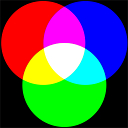

# RGB Decomposition image

### Objective

Write a program that loads an image and create three new ones, each one containing a color channel from original image.

Original image:

### How To Run

Release version:

<code>
make clean 
make 
./Bin/Test Resource/Image/RGBImage.jpg 
</code>

Debug Version:

<code>
make clean 
make debug 
./Bin/TestDebug Resource/Image/RGBImage.jpg 
</code>

### Output

<code>
Program start. 
Algorithm duration: 100 ms 
Program end. 
</code>

Images generated:

