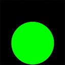
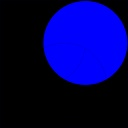

# RGB Image Decomposition Algorithm

### Objective

Write a program that loads an image and create three new ones, each one containing a color channel from original image.

Original image:


### How To Run

Release version:

```bash
make clean
make
./Bin/Test Resource/Image/RGBImage.jpg
```

Debug Version:

```bash
make clean
make debug
./Bin/TestDebug Resource/Image/RGBImage.jpg
```

### Output

```bash
Program start.
Algorithm duration: 100 ms
Program end.
```

Images generated:






